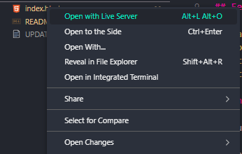

# UP204896

# Satellite Simulation Project

## Overview

This project is a WebGL-based 3D simulation of a satellite orbiting Earth. It features realistic lighting, textures, and motion, providing an great visual experience. The project is developed using JavaScript and WebGL technologies.

## Features

- Realistic 3D rendering of Earth and a satellite.
- Smooth animation of the satellite orbiting Earth.
- Interactive camera controls to view the simulation from different angles.
- Detailed lighting and texturing to enhance realism.

## Installation

To run this simulation, follow these steps:

Method 1:

1. Download the zip file containing the application. It should contain following files:
   - app.js
   - helper.js
   - index.html
   - earth.jpg
   - liveServer.png
   - README.md (this file)
2. Open the file 'index.html' in your browser. Ensure you use Mozilla Firefox
   You might encounter issues with the application if opened in different browser.

3. Start using the Application

Method 2 (Using Visual Code Studio):

1. Download the zip file containing the application. It should contain following files:

   - app.js
   - helper.js
   - index.html
   - earth.jpg
   - liveServer.png
   - README.md (this file)

2. Press the 'index.html' with the RMB and select 'Open with live server', make sure you use the
   Mozilla Firefox as you might encounter problems with different browsers.
   

3. Start using the Application

## Usage

- View Controls:

  - Rotate the view by clicking and dragging the mouse.
  - Zoom in/out using the mouse wheel.
  - Adjust the satellite's orbit with arrow keys:

- Control animation:
  - LeftArrow: Increase the size of an orbit
  - RightArrow: Decrease the size of an orbit
  - UpArrow: Increase the speed of the satellite
  - DownArrow: Decrease the speed of the satellite
  - Space: Stop the satellite

## Acknowledgments

- Earth texture provided by the University.
