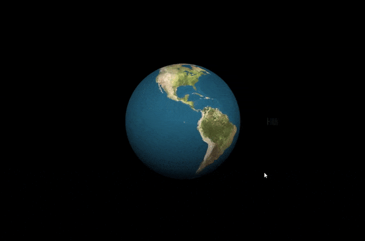

## Overview

This repository contains two projects developed as part of Computer Vision and Graphic coursework:

1. **Speeding Camera Simulation**  
   A Matlab-based simulation that utilizes image processing techniques to measure vehicle speed, dimensions, and detect specific features such as vehicle color and type.

2. **Satellite Simulation Project**  
   A WebGL-based 3D simulation that visualizes a satellite orbiting Earth with realistic lighting, textures, and motion.

Each project has its own README file with detailed instructions and information.

---

## Projects

### **1. Speeding Camera Simulation**
- Developed using **Matlab**.
- Simulates the detection of vehicles to measure speed and dimensions using image processing techniques.
- Special features include:
  - Speed and size measurement.
  - Detection of red vehicles and fire trucks based on size and color.

Refer to the **Speeding Camera Simulation README** for detailed setup and usage instructions.

---

### **2. Satellite Simulation Project**
- Developed using **JavaScript** and **WebGL**.
- Simulates a 3D satellite orbiting Earth with:
  - Realistic lighting and textures.
  - Smooth animations and interactive camera controls.
- Controls allow users to adjust satellite speed and orbit size.

Refer to the **Satellite Simulation Project README** for detailed setup and usage instructions.

---

## General Notes
- These projects were developed as part of coursework at the University of Portsmouth.
- Ensure that the required software (e.g., Matlab or a WebGL-compatible browser) is available for running the respective simulations.
- Acknowledgments for textures and images used in the projects are provided in their respective READMEs.

For further details, check the individual README files located in the respective project folders.
